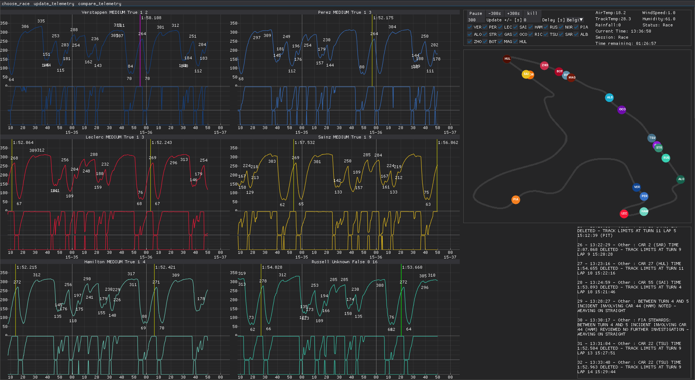
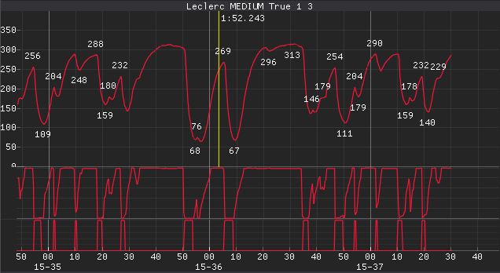
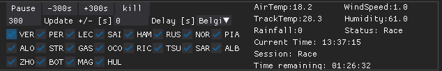

# F1-LiveTiming
F1-LiveTiming is a python package for displaying and analyzing F1 telemetry for past and real-time sessions. 

## Main Features
### Telemetry View Tab
* It is possibile to select which drivers to see in the 'main page' without scrolling from the menu
 
* Basic play/forward/backward functionalities 
 
* Map display 
* Race messages window
### Telemetry Analysis Tab
* Still under development (see TODO)
## TODO
* In the (near) future there will be the possibility to have the live-standings next to the race messages window
* In the analysis tab there will be the possibility to select specific laps for each driver to in-depth analyze their performance 
* Many more features
## Installation
Under construction
## Documentation
Under construction
## Notice
F1-LiveTiming is unofficial and is not associated in any way with the Formula 1 companies. F1, FORMULA ONE, FORMULA 1, FIA FORMULA ONE WORLD CHAMPIONSHIP, GRAND PRIX and related marks are trade marks of Formula One Licensing B.V.

